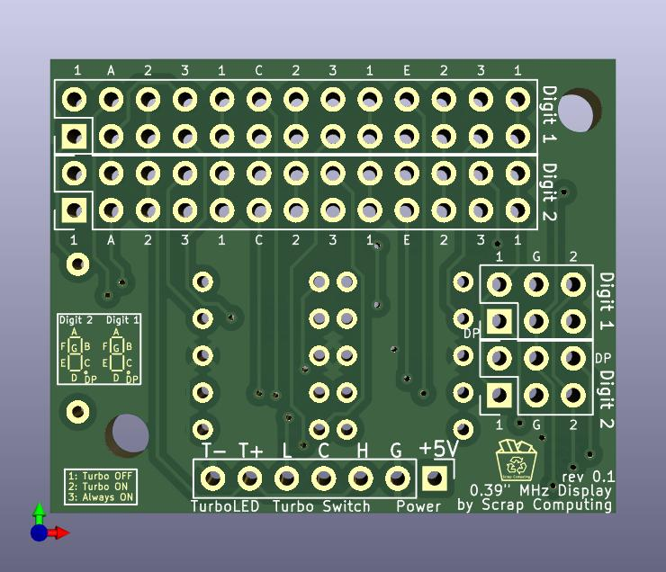
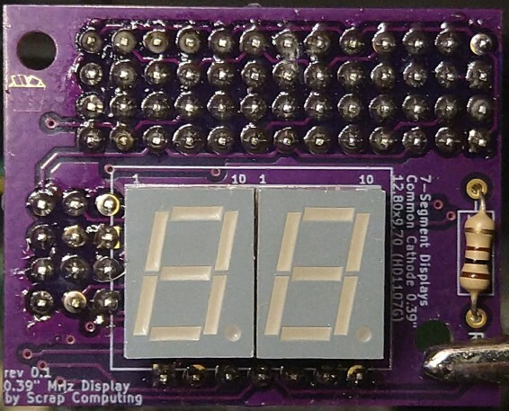

# A Turbo LED MHz Display with 0.39" sized digits

A MHz Turbo LED display with 2x smaller 0.39" digits (12.8mm x 9.7mm x 7.0mm common cathode like the HD1107G).
These are smaller than the more common 0.56" display like the [TD-37S](https://github.com/scrapcomputing/MHzDisplayBlaster) or the [K568](https://github.com/scrapcomputing/MHzDisplay_K568).

I don't know the model number of the display that this is compatible with. If you do know please let me know!

As all similar displays, it is powered by 5V DC (pins +5V, G) and it can display a Turbo and a non-Turbo number, depending on the state of the Turbo switch (pins L C H, Low Common High).
It also drives the Turbo LED accordingly (pins T- and T+).

My case did not have an LED display that I could clone, so this is a design based on other common displays, like the [TD-37S](https://github.com/scrapcomputing/MHzDisplayBlaster).

Because of the limited space between the mounting holes, I had to the split the segment selection headers into two parts. The smaller headers are for segment G and the dot (DP).

# BOM

Gerber files are published in the [releases](https://github.com/scrapcomputing/MHzDisplay_0.39/releases).

Quantity | Item
---------|-------------------------------
2        | 2x13 2.54mm pitch pin headers
2        | 2x3  2.54mm pitch pin headers
1        | 1x7  2.54mm pitch pin header
1        | 100 Ohm 1/4 watt resistor (or smaller value for brighter display)
2        | Single-digit 7-segment Common-Cathode 0.39" displays that fit the PCB (display dimensions 9.7mm x 12.8mm x 7.0mm), like the HD1107G.
1        | [PCB](https://github.com/scrapcomputing/MHzDisplay_0.39/releases)

# Schematic

# Photos

# Resources about MHz displays

- The best resource for MHz displays: [minuszerodegrees.net](https://www.minuszerodegrees.net/led_speed_display/led_speed_display.htm). It includes photos and manuals for a large selection of displays.

